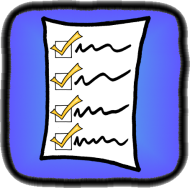

# Using The C# Source Code

The C# version of Coarse Grind should work with any IDE that uses a standard Visual Studio solution file.

Import the Rockabilly_CSharp Project from GitHub as appropriate for your IDE of choice.

To properly use the source code you may need to arrange the project folders in a way that is convenient for your solution file, or configure the above repository [as a sub-module to your own](https://git-scm.com/book/en/v2/Git-Tools-Submodules).

A quick-start to try the example tests: Configure “CoarseGrindExamples” as the default start project and run from the IDE. Point a browser on the same computer to http://localhost:8085

Find the file “ExampleProgram” in namespace “Rockabilly.CoarseGrind.Examples”. This shows how to create the actual test program from which tests are run.

- You must extend the class “TestProgram”.
- Your main() method must instantiate your class and call that instance's runTestProgram() method, passing along the args received into main().
- You will need to implement processArguments(ArrayList<String> args) and process any command line arguments your program needs. You will receive an ArrayList of Strings rather than an Array of them. Any arguments exclusive to Coarse Grind will be filtered out.
- You will need to implement the method getAllTestCases(). This method should create an ArrayList of TestCase objects. For each test case you have coded, instantiate it and add it to the ArrayList. (You might create TestCases that are the same object but instantiated with different parameters. You will need to add each separately configured instance.) Return the ArrayList after it is populated with one of every test case you want.

Take a look at the “Simple” examples for a straight-forward example of a basic test case. For any test case you create, you must implement the following methods...

- getTestSuiteMemberships()
	- A test suite is a collection of test cases of any category intended to run together. Every test suite will appear on the main page of your program's web interface. Use this method to declare which suites you want this test case to be part of. Other test cases may also declare one of the same suites (spelling and casing must be exact). Test suites will not appear as categories on the results summary spread sheet.
- getTestCategoryMemberships()
	- A test category is a group of test cases related to the same thing. A test case may declare membership in as many categories (and suites) as you wish. Any categories it is a member of will appear in the results summary spread sheet. To make it simple to run all tests of the same category, Coarse Grind will show a test suite with the category name on the main page of your program's web interface. It may also be run as a suite from the command line.
- getName()
	- This should return a short, simple human-readable name for the test. Example “Server Record Creation Happy Path”.
- getIdentifier()
	- This can be a numeric code or other short identifier. If your test corresponds to an entry in a test tracking database (such as Spira Team) you should return the same identifier as the database provides.
 
- getTestCaseDetailedDescription()
	- This should be a more detailed human-readable description of what the test is, what it does, what the basic pass criteria. This description will appear in the test log. Developers fixing bugs found by your test may need this description to determine what they must do differently for the test to pass.
- setup()
	- Perform any routines necessary for the test case to set itself up. (Unlike previous versions of Coarse Grind, there is no longer a similar setup routine for the suite or category level.) Your setup method should return true if everything necessary for setting up was completed properly. If it returns false, your test will report “Inconclusive” status and the performTest() method will be skipped.
- performTest()
	- Carry out the actual steps of the test. Use checkPassCriterion() to verify conditions that will fail the entire test if they don't pass. Use checkPrerequisite() to verify conditions that will render the test inconclusive if they don't pass.
- cleanup()
	- This method will ALWAYS run, even if the operator interrupts the test via the web interface. Use this to perform any cleanup that would be necessary if your test ran to completion. (Unlike previous versions of Coarse Grind, there is no longer a similar cleanup routine for the suite or category level.) If your test created any resources locally or on a remote server they should be deleted here. The return value is currently unused, but may be used for future versions of Coarse Grind. Return true if everything cleaned up as expected, or false if there was a problem.

You may also wish to examine the “Descriptions” examples for a more complex approach to test case creation that dynamically creates hundreds of cases from a single base class.

**Using source code from the Git repository will provide the current development snapshot. You will need to reference the DLLs, or the packaged 5.0 snapshot, to use the current stable release.**
 