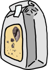
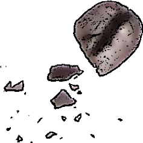

# Coarse Grind

Coarse Grind was created by William Hood, who since 1998 has been a professional “SDET” (a software developer who creates programs to test other programs). Special thanks go to Richard Johnson for feedback and suggestions.

	
	
	
	

       
## What is Coarse Grind?

 Coarse Grind is a C# and Java Test Automation Framework targeted at “large grained” (or “coarse grained”) testing. This is a level above Unit Testing and typically is run against an installed copy of a software product, rather than the product's class objects. Its Java-binaries require a Java 8 JVM. The C# version is recommended to be used from source code, but platform-independent (Mono-compatible off Windows) binaries are provided. The Java source code and examples require Eclipse Neon, but there's no reason the distributed JAR library for Coarse Grind could not be used with Netbeans or IntelliJ. The C# source code works with both Xamarin Studio (Monodevelop) and Visual Studio.

## Why did you find it necessary to create another Test Framework?

Because xUnit falls short of the needs of the testing I typically do, and because I got sick of re-coding new versions of the same tools every time I started a new job or contract. Coarse Grind represents a “reference implementation” of what I would code for an employer (and have many times) when asked to create a test framework. It is released under the terms of the MIT License. This allows an employer to fork the code of Coarse Grind and keep the fork as their own should they choose. A large part of my reasoning in creating Coarse Grind, Rockabilly Common, and my other open source test tools, was that I wanted insurance that my basic tools would come with me in the event something happened to my job (this is the tech industry). Because of the sensitivities of working on my own open source projects while employed to write code for someone else, Coarse Grind, Rockabilly Common Library, and all my other open source projects are developed on my own time and contain no intellectual property of any current or former employer.

## What's wrong with Junit? (..or Nunit, or other xUnit implementations?)

xUnit is designed for Unit Testing and that's not what I do. I typically test an API over the network, or a software product that must be installed and configured first. Some examples of the differences:
- xUnit is designed to halt the test at the first sign of trouble. Typically “everything,” including passing the test, is implemented by throwing an exception. My work usually requires multiple points-of-failure within a single test.
- Unless things have changed in recent years, xUnit frameworks usually compile the tests to a JAR/DLL that requires a separate program to run. It has often been non-trivial to get xUnit running from the command line as a script requires. Coarse Grind currently has a web-based user interface, but has always been designed with running as a console program as the top priority.
- Every time I've used xUnit, I've had to extend it to do many things I typically need, such as adding a log system, saving test artifacts to a designated place, forcing a test system to allow “Inconclusive” or “Subjective” in addition to “Pass” and “Fail,” implementing the “multiple points-of-failure” work-around described above, extending the objects under test to provide the easy variation that software testing requires, etc. Coarse Grind is not xUnit, does not attempt to implement it, and meets all those needs out-of-the-box.

## What's the difference between the Java and C# versions?

The C# version was created as a nearly line-for-line and class-for-class port of the Java source code (my employer needed some testing in C# and I always wanted an excuse to make “Sharp Grind” from Coarse Grind). While changes were necessary to take employ certain language-advantages C# has over Java, as well as making proper use of the .NET counterparts to stock Java classes, the two versions are nearly identical pieces of software.
- The casing/bracing of most of the code was changed to be consistent with what is considered standard in C#.
- Many getter/setter methods were changed to true C# properties.
- Certain method signatures had parameters moved to the back to take advantage of
default values instead of separate methods.
- Many methods in Foundation and the entire StringEnhancements class were changed
to C# extensions of the stock string class.
- I have not done any benchmarks, but the C# version running on mono appeared
noticeably faster than the Java version on macOS Sierra. The same appeared to be true running on .NET in Windows. (C’mon, Oracle, --get off your you-know-what and show Java some love.)

## Sounds neat, but figuring out code written by someone else can be difficult. How can I reach you?

I've provided some example code, and at-least minimal documentation. (...and I will never criticize a developer again for not documenting their code now that I know what it's like.) The written documentation provided addresses the following subjects:
- [Running Tests](Docs/RunningTests.md)
- [Command Line Arguments](Docs/CommandLineArguments.md)
- [Using The C# Source Code](Docs/UsingTheCSharpSourceCode.md)

Unfortunately, I only have so much time and it's called “code” for good reason. You are welcome to contact me with questions related to Coarse Grind [via email](mailto:william.arthur.hood@gmail.com)

## Version 5.0

Changes From 4.x
- C# port created from the Java source code with some changes to keep the two versions reasonably consistent. In the C# version casing has been changed to better match what is preferred for .NET, certain getter/setter methods have become true properties, and certain parameters have been moved to take advantage of default values. BOTH JAVA AND C# ARE FULLY SUPPORTED.
- Improved web-based user-interface. All major browsers are supported and only a small portion of the page needs to frequently refresh. Underlying code has been completely re-written.
- All functionality within the UI to zip-compress and download test results has been removed. First-hand experience, and real-world usage, has shown that it’s better to go directly to the folder of test results.
- The user interface now provides the ability to launch a custom suite of individual tests.
- Symbols.Newline has been renamed Symbols.CarriageReturnLineFeed to make explicitly clear
how it is differentiated from Symbols.PlatformNewline.
- TestCase has been renamed to just “Test.” Many other strings or variable names have been
changed accordingly. TestCaseDetailedDescription is now simply DetailedDescription.
- The Logger has been moved to be a static field of the Test class. Within tests (which extend the
Test class) you may now use “Log.message()”. Outside of theTest class, you may use
“Test.Log.message()”.
- The Global class is now called “CoarseGrind”.
- Test Results are stored off of the “Documents” folder on Mac OS, and any operating system
where the user account contains a sub folder with that name. On Windows, or any OS not having a folder with the true name “Documents” the Test Results folder will be directly off the user’s home directory.
- The Java version’s class DateFieldDescription is still there, but should be considered deprecated. A future version of CoarseGrind will implement stock FieldDescription classes against appropriate objects in the java.time package.
- In the Java version, the bundled HTTP server (part of Rockabilly Common Libraries) works but is considered to be in maintenance mode. Please note that any HTTP Client Classes visible in the Java version of Rockabilly Common are not ready-for-use and may not be developed further.
- The C# version contains a minimal HTTP Server based on the stock HttpListener class. No attempt was made to port the HTTP Client classes as the .NET stock HTTP client classes are considered sufficient and recommended.
- Improvements have been made with aborting tests via the web UI, and in properly concluding tests run from the command line.
